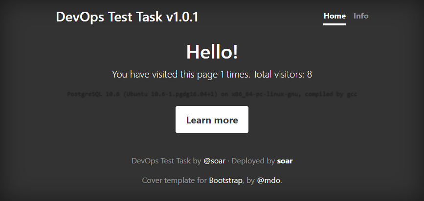

# Introduction

Looking for an experienced DevOps System Engineer is a challengable task, 
because it is usually very difficult to estimate all aspects of person's knowledge.

Technical interview can reveal some strong and weak sides of a candidate, 
but sometimes it leaves opened some questions about real experience.
And if we are talking about real routin tasks - it's not only about knowledge,
but also about skills to perform different kind of tasks using manuals, docs and even Google.

So, the main goal of this test task - is to find out how candidate can perform typical DevOps engineer task,
adopting fresh-written application to run in infrastructure and to be deployed as production environment.

Also, this task shouldn't take more than ~4 hours.

# Application

How it should look: [Running Demo][demo].

All files you need - are in this GitHub repository. Just [clone][github-clone] it or open [on GitHub][github-repository] directly.

This app is written on Python and is pretty simple. 
Why Python? In my own opinion, this is preferred language which any Linux engineer should know. 
But this task is not about programming, so if you don't know Python and are skilled in Bash - It's ok.

Requirements:

- Python `3.6` (any other `3.x` should work too)
- PostgreSQL server
- Packages listed in `requirements.txt` 

All this App does - counts unique visitors and shows this statistic. All it needs is a running database. 

So, this app has some endpoints:

- `/` - main page with all data shown
- `/version` - JSON response with current app version

## Files description

- `migrations` - directory with database migrations (see _Installation_) based on `alembic`
- `static` - just static files for serving UI
- `templates` - HTML template for main page
- `app.py` - main "executable" which contains all code
- `requirements.txt` - list of all Python packages needed to run app
- `requirements.test.txt` - list of all Python packages needed for CI/CD tasks
- `version.txt` - text file with current version

## Installation

To install the application several steps should be completed:

- Prepare PostgreSQL database
- Install all required packages with `pip install -r requirements.txt`
- Set all required environment variables
- Apply all migrations with `flask db upgrade`
- Start application

For the last step you can use different approaches - just choose one from [official docs][flask-deploy].

## Configuration

As any Docker-ready application - It can be easily configured via environment variables. So, here is a list of them:

- `DATABASE_URL` (required) - connection string to your database, you can find examples [here][flask-sqlalchemy-connstr].
- `USER_NAME` - your name, which will be shown on the page
- `USER_URL` - some kind of your personal URL

# Task

So, now we can talk about the goals. 
I'm writing just roadmap and any step is optional, but will give additional points if is done correctly.
If you are good in docs - spend more time on writing good documentation, 
if you have good experience in clouds - write scalable, fault-tolerant and cloud-ready solution.
Feel free to choose your way and show your best.

Ideal solution should be fulfilled as a git repository, which will contain all Infrastructure-related code ([IaC]), scenarios, diagrams and documentation as a main `README.md` file. 

## Infrastructure

I think the best option for this is [Terraform]. But you can also use [Ansible] or [Chef], or any tool you want. 
It will be great, if your solution can be used from the box to start whole stack on AWS.

- [ ] Start all related servers/instances/logical units
- [ ] Make required changes in OS
- [ ] Install Docker (or any other kind of containerization software)

## Containerisation

`Dockerfile` - should be included, but it isn't, because developer of the app was too lazy for this task... 
So, it will be first step to build container with this app - writing `Dockerfile` and making first `docker build .`.

- [ ] Choose right base image
- [ ] Include all installation steps
- [ ] Make this app run and listen on HTTP interface
- [ ] Prepare `docker-compose.yml` for whole app stack, which can be used by developers

## Analysis 

All tools you need for this section are in `requirements.test.txt` file,
which can be easily used with `pip install -r requirements.test.txt`.

- [ ] Lintering
    - [ ] Code style 
        Just use [flake8] and configuration from `setup.cfg`
    - [ ] Static typing 
        This project can be verified with [mypy] static types checker, configuration for it can be found in `setup.cfg`
- [ ] Tests 
    There are no so many tests, but you can run them with `pytest .` and get successful results
- [ ] Code coverage 
    Checkout Python [Coverage] project, 
    or, you can get integration with [CodeCov] or [Coveralls] - they are free for open-source repositories.   

## CI/CD

At this stage you already have project, that can be built and verified for some kind of issues. 
It's time to automate it.

Choose one of CI/CD you like:

- [ ] GitLab 
    All you need - `.gitlab-ci.yml` file as described [here][gitlab-ci-yml].
- [ ] BitBucket 
    You can also pass this stage using [BitBucket Pipelines][bitbucket-pipelines].
    Just implement build step and deployment somewhere - from AWS to K8s.
- [ ] Jenkins 
    Most complex but more powerfull than others (IMHO). 
    If you choose it - you need to write working `Jenkinsfile` to achieve the goal.
    I recommend to use scripted, not declarative pipeline - it would be much better to show your experience.
    Documentation about Jenkins Pipelines is avaiable [here][jenkins-pipelines].

And of course don't forget about:

- [ ] Database Migrations 
    Application should perform DB migrations (as described above) on each deployment to update schema for new code.
- [ ] Versioning 
    Current project version can be seen in file `version.txt` and it will be shown as version on web-page.
    What about adding build number to this version and auto-increment it on each build?
    
## Monitoring

Just prepare some examples, how this app could be monitored. 
Docker Healthchecks or rules on AWS Route53 - anything will be accepted as solution.

## Documentation

Documentation should include key points such as:

- [ ] What technologies were used and what tools are needed to use your solution?
- [ ] How to start this service from scratch using your solution?

Also, you may write additional docs like:

- [ ] How to scale number of servers to take more load?
- [ ] What is application deployment architecture diagram?

To draw diagrams you can use [Draw.io][drawio], [CloudCraft] or even [ASCII Art][asciiflow]. Include them in your repository too.

## Fixes?

There are some problems in app architecture. If you have a solution - it will be great!

# Questions?

If you still have some questions about this task, feel free to [ask me](https://soar.name/contact/).

# License

[][license]

This work is licensed under a [Creative Commons Attribution-ShareAlike 4.0 International License][license].

[github-clone]: git@github.com:soar/devops-test.git
[github-repository]: https://github.com/soar/devops-test

[license]: http://creativecommons.org/licenses/by-sa/4.0/

[demo]: https://soars-devops-test.herokuapp.com

[ansible]: https://www.ansible.com
[aws]: https://aws.amazon.com
[bitbucket-pipelines]: https://confluence.atlassian.com/bitbucket/build-test-and-deploy-with-pipelines-792496469.html
[chef]: https://www.chef.io
[asciiflow]: http://asciiflow.com
[cloudcraft]: https://cloudcraft.co
[codecov]: https://codecov.io
[coverage]: https://coverage.readthedocs.io
[coveralls]: https://coveralls.io
[drawio]: http://draw.io
[flake8]: http://flake8.pycqa.org/en/latest/index.html
[flask]: http://flask.pocoo.org
[flask-deploy]: http://flask.pocoo.org/docs/1.0/deploying/#deployment
[flask-sqlalchemy-connstr]: http://flask-sqlalchemy.pocoo.org/2.3/config/#connection-uri-format
[gitlab-ci-yml]: https://docs.gitlab.com/ee/ci/yaml/
[iac]: https://en.wikipedia.org/wiki/Infrastructure_as_code
[jenkins-pipelines]: https://jenkins.io/doc/book/pipeline/
[mypy]: https://mypy.readthedocs.io/en/stable/index.html
[terraform]: https://www.terraform.io
